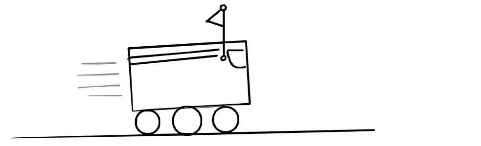
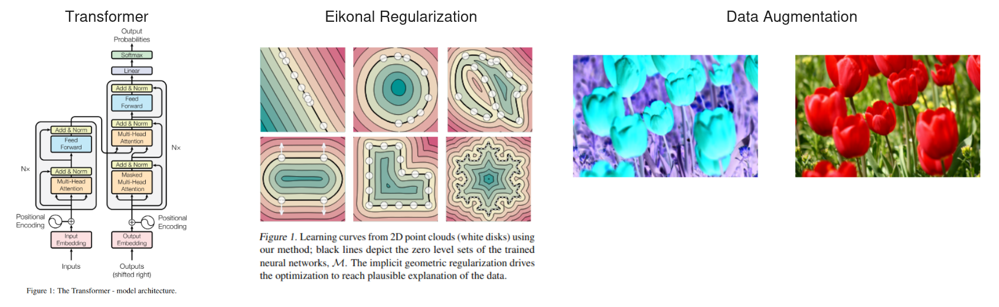
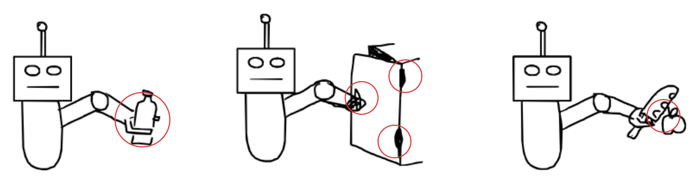

## 1 Not That Kind of Lunch

I attended a fair amount of seminars back at the University of Utah. I remember some of them providing free food—a glorious sight to a starving college student. Bagels, cookies, and the occasional pizza. Unfortunately, this post has nothing to do with free food at seminars. This post also has nothing to do with those little robots that deliver food on various college campuses (quick sketch below), but it does have something to do with the ['no free lunch' theorem](https://en.wikipedia.org/wiki/No_free_lunch_theorem).

The 'no free lunch' (NFL) theorem, which I dive into in the next section, basically says that observed data alone can never give us the information to generalize to unseen data. Woah. If that's the case, how does anything in machine learning ever work? Well, the answer is that if your problem has any sort of *structure*, then having the right inductive biases *enables* generalization. In robotics, we are lucky to have tons of structure in our problems—and thus free lunch if we can leverage that structure. In this post, I want to tell a story that takes us from the NFL theorem to inductive biases to robotics, with a specific focus on robotic manipulation.

Fundamentally, for robot intelligence, robots need to be capable of taking information from the past and present, and translating that into knowledge about the future. This is *only possible* through leveraging (at least some of) the structure inherent in robotics problems. Of course, roboticists are already doing that, so this piece is mostly just repackaging and stitching together a few old ideas.

## 2 The 'No Free Lunch' Theorem

Originally introduced in [@wolpert1996lack], the 'no free lunch' theorem argues that, under certain assumptions, all hypothesis functions perform the same off-training-data when averaged over target functions. Here is a formulation of the theorem:

> **Theorem.** With a homogenous loss $L$, hypothesis function $h$, and data $D$, then the error on off-training-set points averaged uniformly over all target functions doesn't depend on $h$: 
> $$ \mathbb E_f [L_\text{off} (h, f)] = C $$
> for some constant $C$, which doesn't depend on $h$.

I'm not going to prove it, but if you think about it, it should make sense. It is also both very profound and very impractical. The 'no free lunch' theorem has a rich connection to the [problem of induction](https://en.wikipedia.org/wiki/Problem_of_induction), and it gets at the fundamental conundrum of whether there is any reason a past observation can tell us something about a future observation. On the other hand, we make these sorts of inferences all the time—*Machine learning works pretty well*, actually. The 'no free lunch' theorem isn't wrong—it's worse than that—it's incredibly unuseful. The *why* behind this lack of usefulness brings us to the idea of *inductive biases*.

## 3 On Inductive Biases

Generally, I believe the sun will rise tomorrow. I would imagine you do as well. This belief stems, at least in part, from the fact that the sun has risen every single day of our lives. This sort of reasoning—making generalized future inferences from specific past inferences—is known as *induction*. When performing inductive reasoning, the only way to change our beliefs about unknown things is to leverage some sort of bias towards certain types of explanations or models. In the case of the rising sun, I am using the bias that things in the future will be like things in the past. These sorts of biases are known as *inductive biases*. There is an old essay in ML, [@mitchell1980need], that argues the necessity of such inductive biases in machine learning. In the essay, Tom Mitchell defines inductive bias as any sort of selection criteria for a model that doesn't depend on the data seen.

There is a lot to say on inductive biases, so I'm not even going to try to do it justice here. I mentioned it as an approach to increase generalization in robotics in a [previous post](/posts/robustness_and_robotics/). At it's core, inductive biases work because there is some sort of structure to what target functions (or models) you expect. In many ways, the success of architectures like the transformer [@vaswani2017attention], specific regularization like Eikonal regularization [@gropp2020implicit], and practices like data augmentation (or domain randomization) can be viewed under the umbrella of inductive biases (perhaps inductive biases deserves its own post). Each of these things changes how the learning algorithm will select its model given some data, and they all work because they exploit some underlying structure (which I mentioned is a good idea in my [overfitting post](/posts/overfitting_is_fine)). Here is an image of those 3 things I mentioned:  

But that stuff is all computer vision and natural language processing stuff, and while it is related, what I care about more than those domains is robotics. That brings us to the question of *what sorts of structure exists in robotics that we can fashion inductive biases out of?* 

## 4 The Structure in Robotics

Structure abounds in robotics. Here, I highlight just a couple elements of structure in robotic manipulation tasks. These are the places where we can get our free lunch!

### 4.1 Geometry

Robotic manipulation is fundamentally a 3D thing. The world we live in is 3D, and to interact with that world, you need to act in 3D. Thus, the *geometry* of the world underpins a lot of robotics. As I mentioned, there is some work suggesting that phrasing a policy in 3D point clouds can make it more robust than using 2D images [@peri2024point]. The structure of 3D geometry is also why folks like to use depth measurements from RGBD cameras or LiDAR to inform robotic systems. 3D geometry also ties into my next bit of structure—physics, specifically contact. See, *contact* is invariable tied to 3D geometry. When a robot makes contact with something, it needs to hit the *surface* of that something, which exists in 3D space. Geometry matters to contact dynamics. At the end of the day, geometry and 3D information is core to robotic manipulation—even vision-language-action (VLA) models, like Open VLA [@kim24openvla], tend to use things like end effector *3D pose* in their action space. 

### 4.2 Physics

Physics, Contact, Dynamics are really what robotic manipulation is about. The world we live in is governed by physics, and to interact with that world, robots have to contend with physics. In Matt Mason's blog post, [*The Heart of Robotic Manipulation*](https://mtmason.com/the-heart-of-robotic-manipulation/), he argues for the fundamental importance of contact. He makes a compelling case—just think about all the things that a robot might need to do in manipulation: grasping, opening drawers, cutting vegetables, cleaning spills, etc. They all necessarily involve contact. Here is another sketch that shows what I mean:

Intertwining contact with learning is something that has been studied in robotics, with things like ContactNets [@pfrommer2021contactnets] and differentiable physics engines, but I think there is still lots more to explore here. 

## 5 Conclusion

My closing message is that if we want robots that can perform all sorts of generalized autonomous manipulation tasks, we have to leverage the structure inherent in those tasks. This isn't to ignore the data, however. As Animesh Garg argues in [his blog post](https://praxiscurrents.substack.com/p/the-age-of-empiricism-in-physical), scaling up our data will ultimately aid in building intelligent robotics. But as he also alludes to, data alone is not sufficient. And especially considering the diversity of tasks that a generally intelligent robot would have to perform, I have a hard time thinking our current robotic datasets will get us there without some serious inductive biases—in other words, robots will need that free lunch.

## References

