## 1 Introduction

I had the opportunity to attend ICRA 2026 in Vienna last month and wanted to make a post highlighting some loose trends and giving my thoughts on where the field of robotics is headed. I made a [similar post for last year's ICRA](../p_hacking_icra/), but this time, the plots are a bit prettier.

![Me presenting my work [@wright2025robust] in Vienna!](./input.jpg){width=40%}

Overall, there was a lot of the same-old stuff at this ICRA, with a couple noticeable trends. I do somewhat think that certain fields (mostly robot learning) have a higher propensity to exhibit year-to-year trends, as things just seem to move faster in those fields. Thus, I think VLAs and humanoids were the clearest trends that I saw this year. But before I spoil too much, I should probably give a high-level overview of the conference and my methodology before reading the tea leaves to report apparent trends.

## 2 Some High Level Statistics

Overall, the acceptance rate for this ICRA clocked in at 38.04%, which was slightly below the 2025 acceptance rate. This year's conference contained 1882 accepted papers as well as over 1000 journal transfers (according to the acceptance email everyone received). It was full of papers from diverse institutions (submissions came from 86 different countries), though some institutions were a bit more represented than others. Notably, a lot of the top universities (including both of the top two) were from China. For reference, here is a figure I made ranking top institutions by the proportion of papers where at least one author on the paper was affiliated with the institution[$^1$](#footnotes):

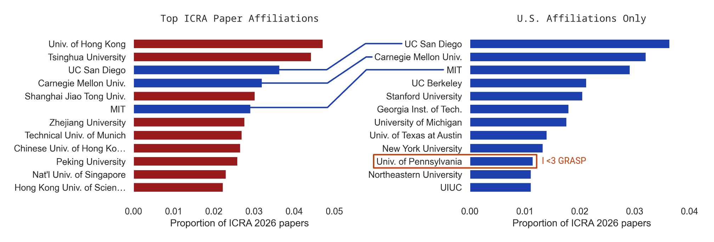

For the rest of the plots in this post, I use pretty much the same methodology I used in my [ICRA 2025 post](../p_hacking_icra/). I take the titles and abstracts from all ICRA papers and count the proportion of papers that have either abstracts or titles that contain certain phrases or substrings. This allows me to make statements such as: similar to 2025, this year's ICRA contained papers from a wide and diverse set of topics:

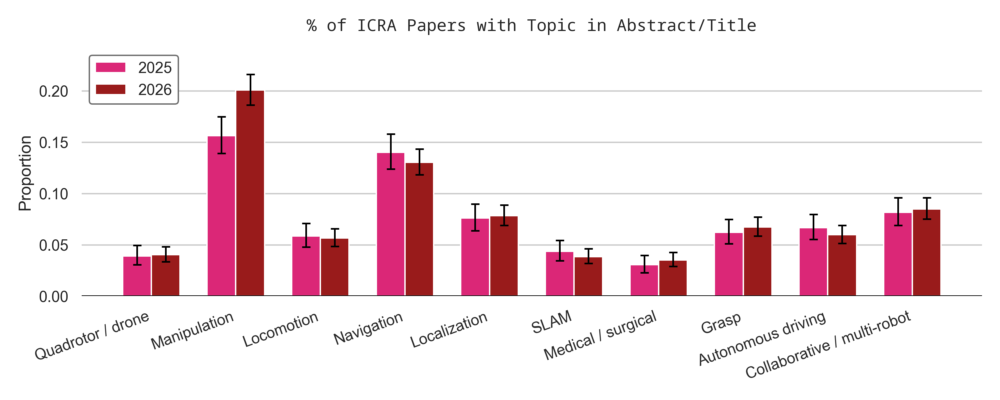

**Disclaimers:** first of all, I am biased towards the things in robotics that I work on—manipulation, uncertainty, machine learning, etc.—so I am much more likely to look for and report trends related to those topics than others. There are also some limitations to my methodology. One red flag is that I used the IEEE proceedings for ICRA 2024 and 2025 papers, but the RAS proceedings for ICRA 2026, which includes journal transfers (this results in ICRA 2026 having $N=2776$, while ICRA 2025 has $N=1604$). Another disclaimer is that word counts are not necessarily unbiased indicators of the trends in a field, and I am kind of using my own judgement with some of these trends—this is, after all, a bit of an exercise in storytelling. Finally, please pay attention to the y-axes in each plot as each has different scales and are not directly comparable.

## 3 Some Trends

### 3.1 Manipulation is Bigger Than Ever

Many of the most interesting, exciting, and difficult problems in robotics lie in robotic manipulation [@mason2018toward], and it seems like the interest in manipulation keeps growing each year:

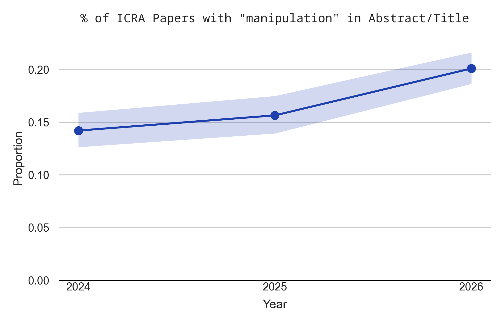

As you can see, the proportion of papers that mention manipulation increased significantly from last year, with about 20% of all papers this year containing the word "manipulation" in the title or abstract (which was also noticeable in the ICRA topics plot further above). It shouldn't be too surprising that I'm a big fan of the increased popularity of manipulation, as the paper I presented was on grasping [@wright2025robust]. One of my hopes with the field's focus on manipulation is that the field can make further progress towards more [reliable and robust manipulation](../robustness_and_robotics/), as well as moving beyond simply pick and place (not that there isn't active research on manipulation that isn't pick and place). One area where I would like to see this occur is within benchmarking and evaluation (e.g. work like [@zhang2025real]). For example, when vision-language-action models (VLAs) are evaluated, it is almost always some form of pick and place. Speaking of VLAs, the next trend in my post is about their rise this year.

### 3.2 VLAs are Heating Up, LLMs are Cooling Down

It almost feels like a lifetime ago that ChatGPT was first released in 2022. Ever since large language models (LLMs) started showing signs of being reasonable, there have been roboticists looking for ways to put them into robotics (e.g. SayCan [@ichter2023say]). However, at some point, it became clear that *vision*-language models (VLMs), where a vision encoder or decoder is also trained into the embedding space, might be a bit more useful in robotics, where visual data and understanding is often critical. As it turns out, LLMs and VLMs seem to do reasonably well at open-world task planning problems [@huang2023voxposer;@tang2025tru]. However, in the past couple years, vision-language-*action* models (VLAs) became the hottest new thing. I even remember being shown a demo of $\pi_0$ [@black2024pi_0] during my visit days at GRASP back in 2025. By putting an action head on top of a VLM and training on the biggest datasets around, people started to do some cool things. The rising popularity of VLAs compared to LLMs is evident in the ICRA proceedings:

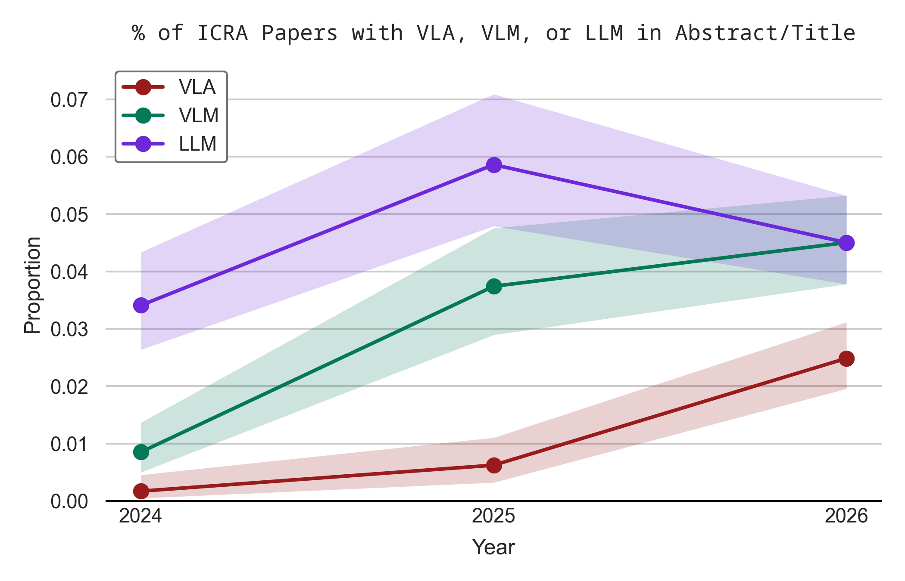

In the plot, we see that the popularity of VLAs has risen drastically this year, with the popularity of VLMs rising moderately. In contrast, LLMs seem to be a bit *less* popular this year than last year. Overall, however, LLMs remain more likely to be mentioned in the title/abstract of an ICRA paper (4.5%) compared to VLAs (2.5%).

I do think that there is a newer kid on the block than VLAs, though. I am of course talking about *world*-action models (WAMs) [@ye2026world], where video prediction meets action prediction. Whenever a large pretrained model—an LLM, VLM, video generation model, or other massive model—is used in some way in robotics, it gets the buzzword "foundation model", which interestingly mirrored "imitation learning" by not having a significant increase or decrease in popularity following its jump from 2024 to 2025:

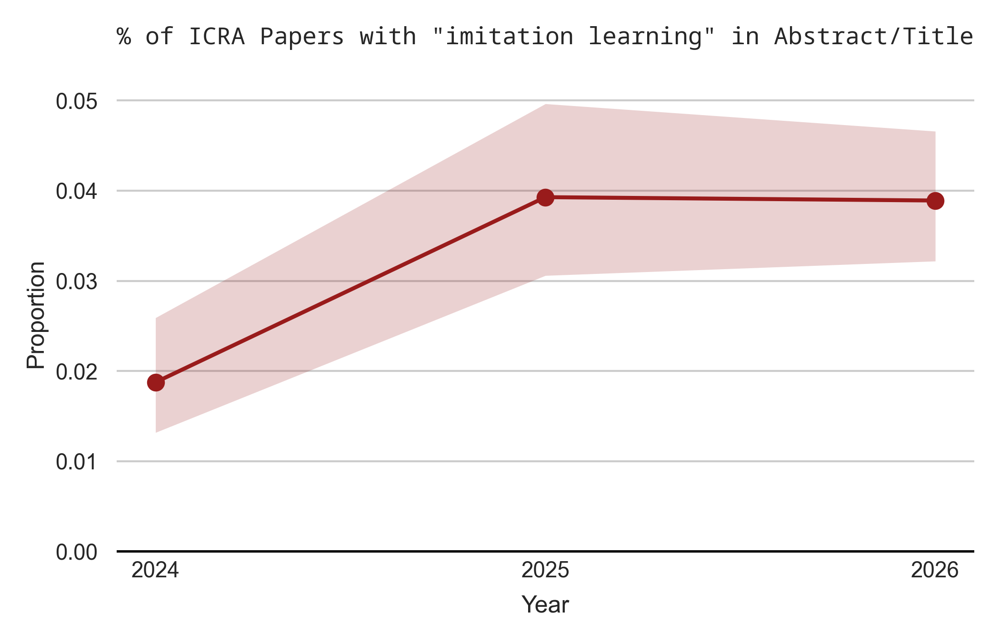{width=49.5%}
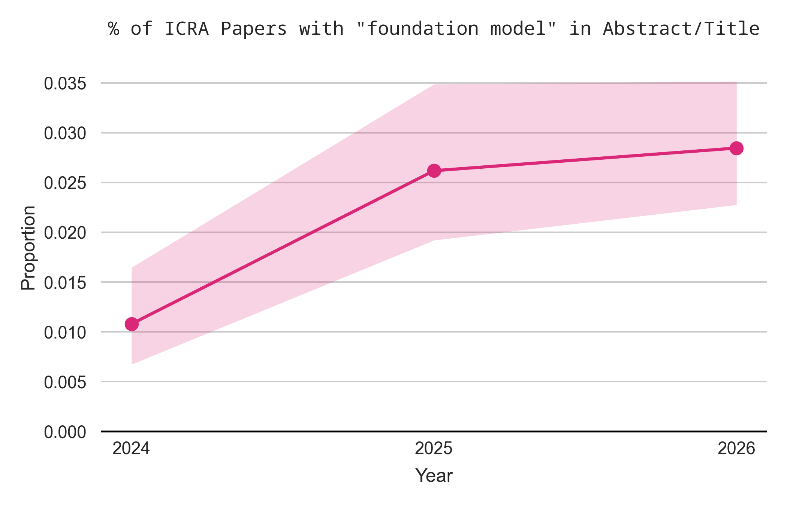{width=49.5%}

### 3.3 The Future is Contact-Rich

I mentioned earlier that I am a fan of robotic manipulation that isn't just pick-and-place, which is not by any means a new sentiment. In the first chapter of the online textbook, *Robotic Manipulation* [@tedrake2024robotic], Russ Tedrake devotes a whole subsection to the point that "manipulation is more than pick-and-place". A class of manipulation problems that moves beyond pick and place can be classified as *contact rich* manipulation—manipulation that involves a lot of, and often diverse types of, contact. Relatedly, dexterous manipulation, involving a multi-fingered hand often results in contact-rich problems that require more sophisticated control than is used with parallel jaw grippers. Excitingly, both contact rich and dexterity seem to be on the rise:

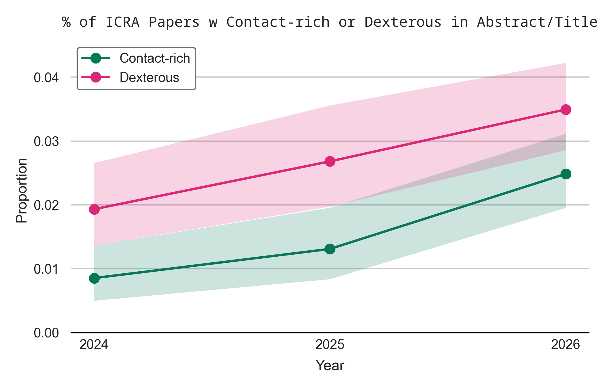

This ICRA, I spent a whole day at a workshop dedicated to contact-rich control ([CR2](https://cr2-icra.github.io/)), where I had a poster on *uncertainty-aware* contact-implicit control [@wright2026uncertainty]. I think there is a lot of room to explore uncertainty with respect to these contact-rich and dexterous tasks, especially given that domain randomization seems to be so important for reinforcement learning (RL) these days. There are other (related) open problems in this space as well—such as bridging the sim-to-real or real-to-sim gap—and I am looking forward to seeing how the research evolves.

Another exciting development is that dexterous hands seem to be getting better, as [pointed out](https://itcanthink.substack.com/p/robot-hands-are-getting-better) by Chris Paxton. With my very limited understanding of hardware, I agree. I got to see the Wuji 2 hand up close and personal this ICRA and was pleasantly surprised by how it looked and felt:

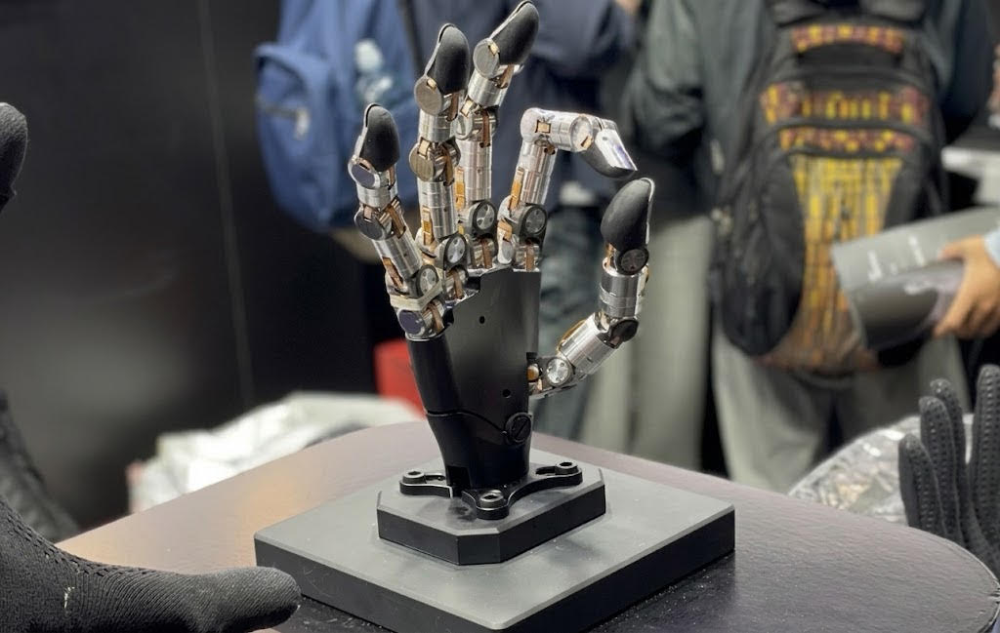{width=40%}

It also had fingernails, which I had never seen on a robot.

### 3.4 Here Be Humanoids

In 2026, it seems like funding for humanoid robots has never been higher. It also seems like the number of papers on humanoids has also never been higher:

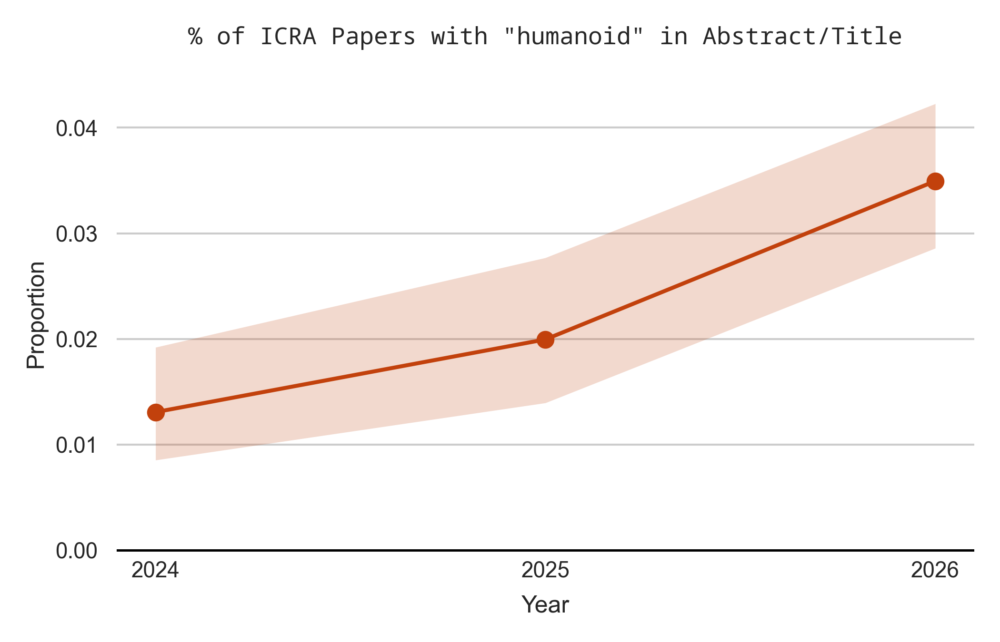

Clearly, humanoids were a real trend this ICRA—perhaps this is related to the dexterous hands. One of the best paper awards at ICRA was OmniRetarget [@yang2025omniretarget] a humanoid retargeting paper that showcased some pretty impressive maneuvers, which included a bit of manipulation as well. Nowadays, reinforcement learning (RL) seems to be the primary way such humanoids are controlled, however RL seems to be on an ever-so-slight multi-year slide:

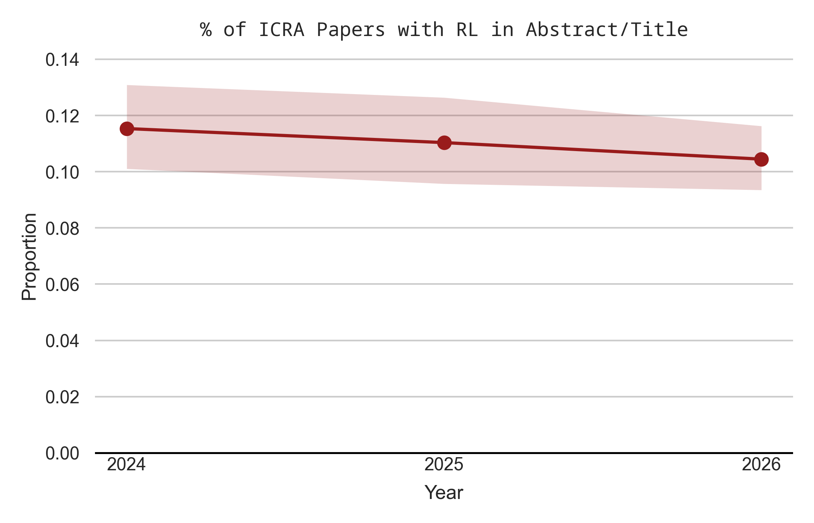

Though to be fair, it remains quite popular, with over 10% of papers mentioning it.

### 3.5 Are We Done With NeRFs?

I remember reading the original neural radiance field (NeRF) paper [@mildenhall2020nerf] in a reading group during my undergrad at Utah. I thought the paper was really cool, and NeRFs started trending in robotics. Then, a couple years after the NeRF paper, 3D Gaussian splatting (3DGS) [@kerbl20233d] came on the scene as a faster, newer alternative. For multiple reasons, Gaussian splatting was a much more attractive alternative for many roboticists, and the meteoric rise of 3DGS in robotics was clearly evident by looking between the 2024 and 2025 ICRA proceedings—something [I mentioned](../p_hacking_icra#gaussian-splatting) in my last ICRA breakdown. This year, the trend of 3DGS being more popular than NeRFs continued, though both became less popular:

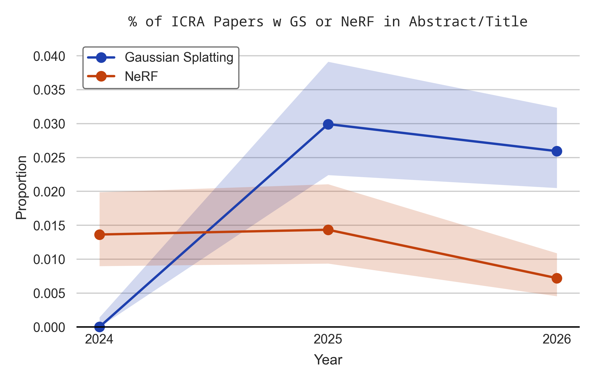

Noticably, the proportion of papers mentioning NeRFs was about half of what it was last year. This sparks the question: *are we done with NeRFs yet?* In my mind, there is rarely a benefit to building a NeRF when Gaussian splatting is often a more performant alternative.

## 4 Conclusion & My Thoughts

Overall, it seems to be a very exciting time to be in robotics—especially manipulation. I mentioned how I hope the increased focus on manipulation will give more energy to pursuits such as developing more mature manipulation techniques beyond pick and place. A prediction I have for next time is that we will see a major rise in world action models; I'm not sure if they will overcome the popularity of VLAs, but I think we will see them get high scores on benchmarks. Another major research direction I am bullish on is real-to-sim methods. I didn't talk about it much, but a lot of different subcommunities are interested in better real-to-sim—for example, it was brought up as a desideratum for better contact-rich control in one of the CR2 workshop panels. A clear trend this year was the rise of humanoids, and I honestly remain slightly unconvinced. Relatedly, I think there is too little research into having better non-strictly-humanoid morphologies for robots. 

## Footnotes

$^1$ I saw this figure circulating from LinkedIn, and I'm pretty sure they used a different methodology for coming up with the number (raw author count vs proportion of papers), so they had different, but correlated rankings:

](image.png){width=50%}

## References

