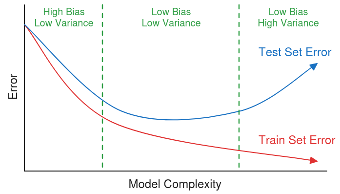
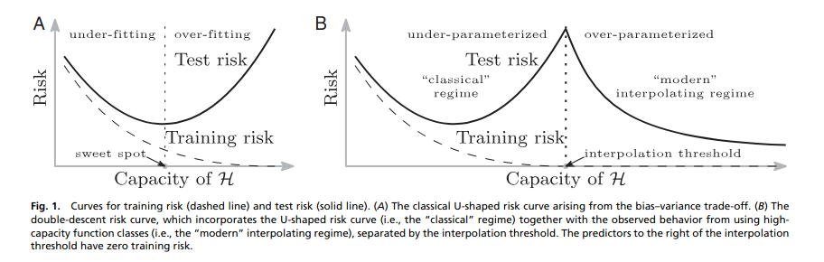
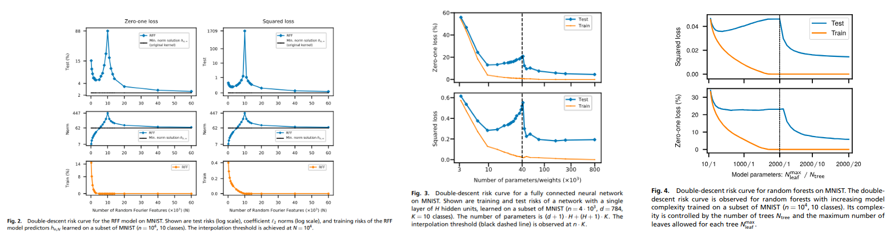

## 1 The Bias-Variance Tradeoff and Overfitting

Apparently, people in the machine learning community used to believe in something called the *bias-variance tradeoff*. The story went like this: if you use an ML algorithm that is too simplistic for your data, the algorithm will be too *biased* and perform poorly on both the train and test set. Fair enough. On the other hand, the story continues, if your algorithm is too expressive and complex, it will be too sensitive to the *variance* of the training set and perform poorly on the test set. There was an accompanying graph that looked something like this:

The concept of *overfitting* is related to the bias-variance tradeoff. Overfitting is what happens on the right-hand side of the graph: your model is so sensitive to the training data that it "overfits" to the training data, meaning that it fails to generalize to the test set. In fact, here is the definition of overfitting found on Wikipedia, originally from Oxford dictionary (I should note that [not everybody is satisfied with this—or any—definition of overfitting](https://www.argmin.net/p/thou-shalt-not-overfit)):

> The production of an analysis which corresponds too closely or exactly to a particular set of data, and may therefore fail to fit additional data or predict future observations reliably.

Fortunately, the year is 2025, and neural networks are *in* (they have been for a while). And neural networks contradict our bias-variance and overfitting story. Nowadays, people in the machine learning community such as Mikhail Belkin proclaim, "Fit without fear" [@belkin2021fit]; your model can and should "correspond too closely or exactly" to your training data—how else do you think scaling laws work? For the next part of this post, I want to try to connect the dots; how does one go from believing in the bias-variance tradeoff to embracing overfitting—or *exact fitting*, to be more precise?

**Note:** *I remember Mikhail Belkin presenting "Fit without Fear" at a seminar while I was at the University of Utah—that talk was probably what sparked my interest in this stuff!*

## 2 Deep Learning and Generalization

Fairly early on in undergrad, before I got involved in research, I happened to read a paper titled, *Understanding Deep Learning Requires Rethinking Generalization* [@zhang2017understanding]. I'm not sure how much of the paper baby-faced me understood at the time, but the main point of the paper is this: deep neural networks, without explicit regularization, can achieve 100% accuracy on both randomized labels and the true labels of the training set—and not only that, but when these models exactly fit the true training set, they generalize pretty well to the test set. Now, in 2025, this is probably obvious, but if you believe our bias-variance story, this is quite distressing. We have a learning method that fits its training data exactly—classic overfitting—then turns around and *does well on the test set*. What should we make of that? 

Well, in 2019, Belkin et al. proposed an extension of the bias-variance curve that they named the *double descent* curve [@belkin2019reconciling]. The idea is that the bias-variance curve could be extended to the right into an over-parameterized regime, where test error would once again drop. Here is the figure from their paper showing this:

They then went on to show how this pattern emerges from several learning algorithms. They looked at random Fourier features (RFFs [@rahimi2007random] are cool), fully connected neural networks, and random forests (all on MNIST). Here is a compilation of figures from the paper showing the real-life double descent curves:

A new narrative is starting to develop: after a certain "interpolation threshold", you should just keep making your network bigger to get better performance. In other words, in the modern regime, *scaling* gives you more generalization. But the story doesn't end here. As Ben Recht [points out in his blog](https://www.argmin.net/p/overfitting-to-theories-of-overfitting), You don't *always* see double descent. Sometimes test error just looks like a monotonically decreasing function—AKA single descent. This brings us to something that I've already hinted at: neural scaling laws.

## 3 Neural Scaling Laws

Neural scaling laws were introduced by a group of OpenAI researchers in 2020 [@kaplan2020scaling]. These "scaling laws" seem to have become a hot topic in machine learning over the past few years. From my outside perspective, it seems like people like to use scaling as justification for spending an ungodly amount of money to train even bigger transformers, but I think that beyond the hype, the scaling laws are really just another way to describe this over-parameterized-regime behavior. Perhaps there is some nuance here—neural scaling laws look at what happens when compute increases and/or the amount of model parameters increases, while "model complexity" in the bias-variance world is perhaps a bit nebulous, but might be described by VC dimension, fat shattering dimension, or number of parameters. Regardless, the main point is that *bigger models do slightly better*. With this outlook, it's a good thing if we *exactly fit* our training data; it just means our model is getting bigger.

It might be worth noting that as far as I understand, these neural scaling laws are *empirical lower bounds* on test set performance. They are based off of real-life data, not theorems and proofs, and it's pretty easy to do *worse* than the scaling law with a certain amount of compute, number of parameters, and dataset size. This is contrast to the classical derivation of bias and variance from empirical risk. It might be accurate to describe the bias-variance tradeoff as closer to a *theoretical upper bound* on test set performance (maybe?).

## 4 Conclusion

So, go exactly fit your data—overfitting is fine, actually. Then, when your test set performance sucks, probably get more/better data instead of making your model smaller. If you really want to improve your model, make it bigger—or better yet, choose an expressive model class that contains invariances or biases specific to your problem. Things like using a convolutional neural network for images or using Eikonal regularization for your neural SDF [@gropp2020implicit]. Exploit the structure of your problem. But fitting that into the bias-variance, overfitting, and scaling laws story might deserve its own post.

**Note:** *As explored by [@belkin2019reconciling], neural networks aren't the only learning algorithm that gets better as it interpolates; kernel methods do this and are pretty cool. Also, a nearest neighbor approach—basically a database lookup—can both interpolate and generalize.*

## References

