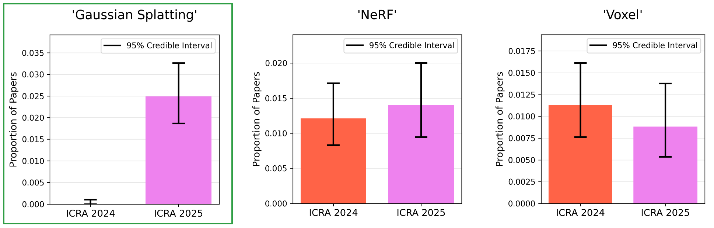
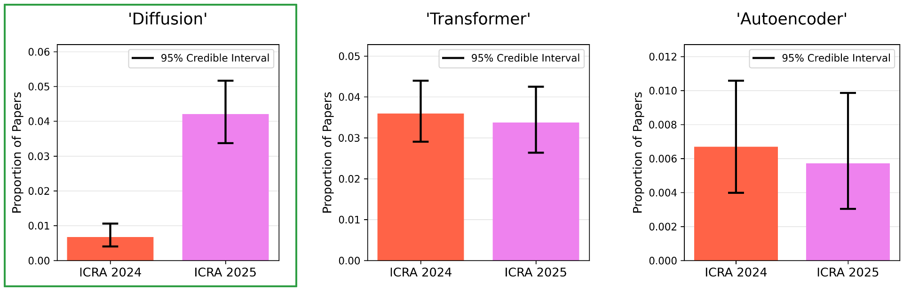
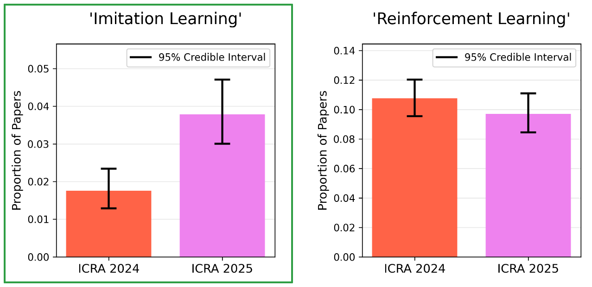
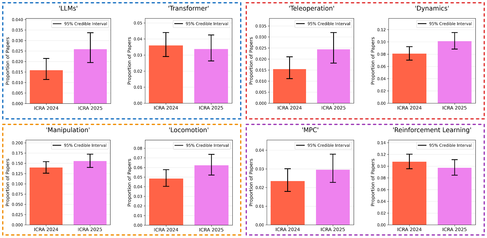

## 1 Introduction

The 2025 IEEE International Conference on Robotics and Automation (ICRA) took place in May, and I didn't go—probably because I didn't submit anything to it. Despite not attending, I do care about what happened at ICRA, because I care about staying up-to-date with the robotics field. I have had the opportunity to talk to a couple of people who did go. The main vibe I got aligned with what Chris Paxton states in his blog: [ICRA was more serious than last year](https://itcanthink.substack.com/p/icra-2025-was-bigger-and-more-serious). "More serious", in this context, means less of attitudes such as *scaling is all you need* and *LLMs solve robotics*. In the blog post, Chris makes his case by looking at the best-paper awards; (one of) last year's best paper was the lofty RT-X paper [@10611477], whereas this year's best papers were a bit more grounded: [@guo2024marginalizing; @qiu2024mac]. Looking at the best paper awards might give some insight into trends in robotics, but it made me wonder if you could do some sort of analysis of all accepted papers to try to tease out robotics trends. I mean, the proceedings, which include title and abstract, are all available online. I figured why not compare 2024 to 2025. How would I know what counts as a trend and what doesn't? Easy—I would just count the frequency of a bunch of words/phrases and p-hack it!

## 2 What Even is P-Hacking?

P-hacking, aka [data-dredging](https://en.wikipedia.org/wiki/Data_dredging), is the somewhat dubious process of doing an excessive amount of statistical tests on a dataset in pursuit of finding statistical significance somewhere. In many communities, a result isn't worth talking about unless it has a significance of $\alpha \leq 0.05$, so p-hacking is a way to find something that is seemingly worth talking about. The problem is that, by running a bunch of tests, you have a much higher chance of finding a false-positive—a result that looks significant simply due to random chance instead of an actual relationship. For this reason, you're not supposed to p-hack—the frequentists are so uptight. In order to avoid violating the frequentist commandment against p-hacking, I am going to make a conceptual change: I am a Bayesian, simply calculating *credible intervals*, and looking for instances where the intervals don't overlap. I will refer to this as a form of *data mining*.  

## 3 P-Hacking ICRA Paper Word Frequencies

Okay, so here is the section where I do the thing and show some matplotlib figures. The main process I did was calculate what proportion of ICRA papers had the respective word/phrase in either the title or abstract (case-insensitive and excluding partial word matches). I treat this as a binary random variable and build credible intervals (using [Jeffrey's prior](https://en.wikipedia.org/wiki/Binomial_proportion_confidence_interval#Jeffreys_interval): $\text{Beta}(1/2, 1/2)$) for the non-existent population proportion. I ended up having 2392 papers from ICRA 2024 and only 1974 papers from ICRA 2025. In this section, I will talk about three trends I saw that actually had "significance", or non-overlapping credible intervals. Also, any errors ought to be attributed to Claude because I made heavy use of&nbsp; *v i b e&nbsp;&nbsp; c o d i n g* &nbsp;to both wrangle, process, and display the data.

**Note:** *When looking at the figures there are a couple things to keep in mind: (1) Please look at the actual scale on the left-hand side as it will be different for each graph and it gives you a reference for scale of a certain topic. (2) The height of each bar is the observed proportion; the credible interval will not be centered at this value because it is a Jeffrey's interval.*

### 3.1 Gaussian Splatting

The first trend is Gaussian splatting, introduced in [@kerbl20233d]. What we are seeing in the above graph is that there were *no* papers in ICRA 2024 that mention Gaussian splatting in the title or abstract. This is because Gaussian splatting didn't really become popular until well after the deadline for ICRA 2024 submissions**\***. If you don't know what Gaussian splatting is, it is the spiritual successor to neural radiance fields (NeRFs) [@mildenhall2021nerf], where a rendering-based optimization problem is solved to construct a 3D representation from a set of images; in the case of Gaussian splatting, the representation is a bunch of Gaussians. Gaussian platting still seems to be pretty popular in robotics, after all, it is faster than NeRFs and uses Gaussians—which seems to be a favorite of roboticists (and me). I also showed the plots of 'NeRF' and 'Voxel', of which, both the credible intervals have lots of overlap. The takeaway here is that Gaussian splatting is *in*.

**\***Actually, I'm not sure if this is completely true. According to Google trends, Gaussian splatting's popularity started rising a few weeks before the ICRA deadline, *I* just didn't hear about it until after—and it *was* well after the ICRA deadline when Gaussian splatting started showing up in published robotics papers. 

### 3.2 Diffusion

The next trend is the term 'diffusion', which is likely due to the rise of diffusion models [@ho2020denoising]. While diffusion has been used a lot in vision applications, there are also diffusion policies [@chi2023diffusion], that have received some hype and are being championed by a couple of people. Diffusion models are cool, and I think they will continue to pop up in robotics methods.

### 3.3 Imitation Learning

In the previous section, I mentioned diffusion policies [@chi2023diffusion], but here we have the term 'imitation learning', which is what diffusion policies are doing. Roughly, imitation learning is an approach to policy learning where you learn from expert demonstrations. The most common form is *behavior cloning*, where you train on on-policy data instead of, let's say, reinforcement learning, where you have to go explore until you have a good policy. We saw a rise in papers mentioning 'imitation learning', and I think it makes sense; it is pretty much what RT-X was doing and seems to have some big names as its proponents. However, I wouldn't draw too many conclusions by a simple increase in mentions of 'imitation learning' at ICRA—it existed, was promising and had limitations in 2024, and it is still promising and has limitations in 2025. I am excited to see how imitation learning can continue to improve and do think it is genuinely promising—especially when combined with more easily accessible data from simulation.

## 4 Other (Statistically) Insignificant Trends

Not every trend I looked at had non-overlapping credible intervals. Here is an image of a bunch of other queries I ran against the dataset:

I grouped them into four different colors, and figured I would make a brief note for each color:

**Blue (Top-Left):** So, in this one, I mainly want to look at 'LLMs'. In the intro, I said that the vibe I got was that there was *less* LLM hype. In the figure, even if the credible intervals overlapped, what we saw was *more* mentions of the term 'LLMs'. Make of that what you will. There are certainly usages of LLMs that I have seen in some papers that make me uneasy, but I think LLMs can be very useful for certain higher-level planning tasks. A recent paper from Apple, [@shojaee2025illusion], argues that LLMs still struggle on sufficiently complex tasks—though, LLMs seem to do fine at high-level task planning from what I have seen (as someone not caught up in the TAMP space). LLMs also seem to be used a fair bit for *scene understanding*.

**Red (Top-Right):** Here, I show two words that got mentioned a little more in the most recent ICRA: 'teleoperation' and 'dynamics'. 'Dynamics' could mean a range of trends, but dynamics models are and have been central to many robotic algorithms, like trajectory optimization, where you might encode dynamics as a constraint. As for 'teleoperation', I don't know too much about it, but I'll just leave [this link](https://itcanthink.substack.com/p/remote-robotic-teleoperation) to another one of Chris Paxton's blogs.

**Orange (Bottom-Left):** This one is 'manipulation' and 'locomotion'. I wanted to see if you could possibly tease out larger trends in robotics, or at least get some sense of scale. As you can see in the figure, about 15% of all ICRA 2025 papers mentioned manipulation in the title or abstract. This number was about 6% for locomotion.

**Purple (Bottom-Right):** Finally, 'MPC' and 'reinforcement learning' is the last one. You can view MPC and reinforcement learning as trying to solve the same or similar problems. While the credible intervals are all overlapping, we did see a *decrease* in papers mentioning RL and an *increase* in papers mentioning MPC. This is not a huge shift, but it aligns with someone who told me that there seemed to be more model-based stuff at ICRA this year. 

## 5 Conclusion

Okay, to be honest, a lot of this post feels like reading tea leaves. I would caution against placing too much weight on the evidence here as precisely reflecting robotics trends. It might be the case that the amount of papers that mention a word is not *that* indicative of the general excitement or popularity of something. It also might be the case that what I was measuring was kind of a lagging indicator of trends; people might mention something in the abstract that *was* a trend, while they explain its shortcomings and/or propose an alternative. There are a ton of ways that the results here might fail to accurately convey what I was ultimately looking for. I do, however, think that a few of the trends are legit. I mentioned Gaussian splatting—that one is for sure real. But for the most part, I think this post was mostly just some [correlations](https://www.argmin.net/p/correlation-is-all-we-have) with a dose of half-baked opinion and storytelling interjected.
<!-- don't draw too many conclusions. I do think there is some validity to some of the trends. Maybe mentions are a lagging indicator of trends -->

## References

