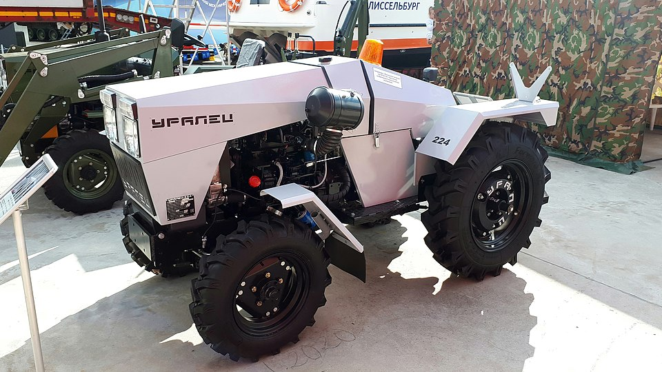

## 1 Introduction

I believe that hypothetical intelligent robots can help people. A lot. In this post, I want to sketch out a few areas where *robotic manipulation*, if it becomes a mature technology, could really make a positive impact on real world people's lives. I mean, consider a world where robots that autonomously farm causes food to be significantly more affordable, construction robots make building affordable housing easier and cheaper than ever, and healthcare robots increase the capabilities and capacities of hospitals. I take it as self-evident that this would make the world better. The three things I mentioned are examples of robots making it easier for humans to fulfill their needs of food, shelter, and healthcare respectively. The rest of this essay digs into each of these needs, in hope to uncover multiple ways that intelligent robots can help people out.

## 2 Food

Did you know that, according to the USDA Economic Research Service, around [13.5% of Americans are *food insecure*](https://www.ers.usda.gov/topics/food-nutrition-assistance/food-security-in-the-us/key-statistics-graphics). That's millions of people where better food access can directly improve lives (not to mention those outside of the US). Robots can help with that.

I mentioned farming earlier, and I think it is important to note that robots are already used all over the place in farming. What I want to emphasize here is the potential of moving from dumb robots like a normal tractor to robots capable of performing tasks with more autonomy, like an autonomous tractor:

There are already a few startups that have been around taking a stab at autonomous farming, and I have seen "agricultural robotics" or something similar be the title of sessions at robotics conferences. There are a lot of different crops that are farmed around the world, and thus a lot of different potential things a robot could do as part of the processes; picking apples, plowing fields, identifying and spraying weeds are all tasks that would require a robot to interact with something (the apples, dirt, or weeds) external to the robot. If robots could cheaply and reliable do these things, we would expect the efficiency to directly impact the prices of such foods—making them more affordable to those who are struggling to make ends meet.

Farming is not the only way robots can give people better access to good food; we can also look to cooking robots. [Americans eat an alarming amount of "fast food"](https://www.cdc.gov/nchs/products/databriefs/db322.htm), which I would bet is not as healthy as most home-cooked meals. Part of the draw to fast food for many Americans, in my opinion, is the convenience. If we lived in a world where we had reliable and cheap intelligent robotic manipulation, we could have robots cook more nutritious meals in the home with the same level of convenience as fast food. I think this would positively impact people—being healthy is a good thing in my book.

The last thing I want to touch on in the food section is transportation. Unsurprisingly, it costs money to transport food from point A to point B, and we very often have to transport food from point A to point B for various reasons. Consider the hypothetical journey a potato might take to wind up in my instant pot (or at least how I imagine the journey might go): the potato in question is grown on a farm (probably in Idaho) and harvested, then it is shipped to a packaging facility where it is put in a package with a bunch of its potato friends, then it is shipped again, eventually landing at a local grocery store, where it is brought and placed in the produce section. I go to the store and, realizing I am out of potatoes, grab a bag to purchase and bring home. Finally, when I get the urge to make a potato dish in the slow cooker, I put our favorite potato into the pot. 

In the previous paragraph's potato journey, there are multiple places where robots might come in. Whether it be in the grocery store, shipping process, or even the cooking robot I mentioned in the previous paragraph being the one to put the potato in the pot, there are multiple ways robots could be leveraged to more efficiently move food from point A to point B. More efficient transportation of food, in my estimation, is a good thing. 

## 3 Shelter

People generally need a place to live, and in many cities, rent and housing prices are just plain unaffordable to the average person at the moment. While I wouldn't say that robots are *the* solution to the housing crises by any means, there is perhaps a world where robots capable of reliably and affordable performing certain manipulation tasks could potentially reduce the cost of housing by making building houses slightly less expensive. Again, not enough to actually fix everything—pro-housing policies are needed for that, in my opinion—but robots could potentially make a difference.

<!-- (1) Construction robots; (2) Helping move / Cleaning up / Chores -->

## 4 Healthcare

The last human need on my list is healthcare, and it seems to always come up when discussing the impact of robotics.

<!-- (1) Robotic Surgery; (2) Cleaning; (3) Caring for the Elderly and those with Disabilities -->

## References

