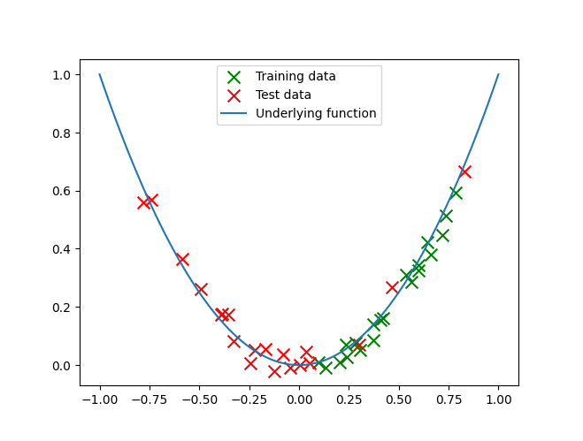
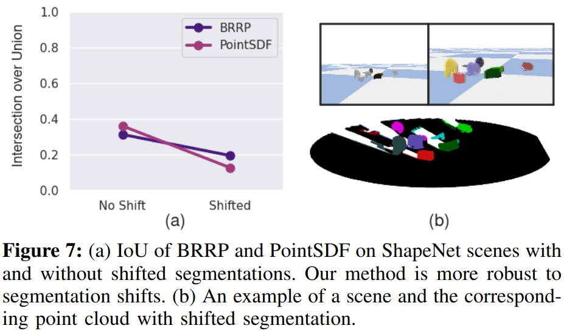

## 1 Washing Machines and Robustness

I want to start with a hypothetical thought experiment. Imagine you are the world's best roboticist and just trained from scratch a spectacular end-to-end policy for opening a washing machine door. In a slight lapse of judgement, you only trained on examples of *front-loading* washers. Then, full of excitement, you take your robot (and trained policy) to your grandma's house. Let's say that, unbeknownst to you, she happens to have a *top-loading* washer. Well, you set the robot loose and chaos ensues—absolutely no washer doors are opened whatsoever. Here is a beautiful diagram I made of the situation:

 

I know, I know, the figure is impressive. But the point is that, in our hypothetical, the policy was clearly not *robust* enough to different types of washers. It didn't generalize. I firmly believe that *robustness* is crucial to the deployability of any sufficiently complex robotics method. Thus, I similarly think that *robustness* is something worth trying to understand in depth—especially in how it relates to current robotics practices and trends. Simply put, our robots need to be reliable, even in novel situations, so we should try to understand how to make that happen.

Now, in the above case, the easiest solution would be to simply train the policy on data from both front and top loading washers, but hindsight is 20/20. And there will most certainly be situations in the "long tail" [@liu2024curse] that we won't necessarily know the specifics of before-hand. Robots need to be robust to those situations. But what does it even mean for a robot to be robust?

## 2 Defining Robustness & Distributional Shift

An informal definition of robustness is that it is when a method can maintain good performance across widely varying circumstances. In a machine learning situation, we can be a bit more technical. Let's assume we draw training data, $D = \{(x_i, y_i)\}$, from a distribution: $(x_1, y_1), ..., (x_N, y_N) \sim \mathcal D$. We can measure the performance of a model trained on that data, $A_D$, to a new distribution, $\mathcal D' \neq \mathcal D$ given a loss function, $l$ like so:
$$ L_{\mathcal{D}'} = \mathbb E_{(x', y') \sim \mathcal D'} \left[ l(A_D(x'), y') \right]. $$
We could say that our model is *robust* to the *distributional shift* of $\mathcal D$ to $\mathcal D'$ if performance doesn't degrade too much ($L_{\mathcal{D}'}$ is still small). *Distributional shift* is what it is called when you test on a different distribution than you train on. This is what happened in the hypothetical open-the-washer-door-policy at the beginning. This is also what the sim2real gap is—a performance gap due to distributional shift. 

**Note:** *There are other types of robustness besides just to distributional shifts that we might care about, such as adversarial robustness; being robust to adversarial examples [@szegedy2013intriguing]. But this post will mostly focus on distributional shifts.*

There are a few different specific types of distributional shift that people have studied. The one that I think is worth mentioning is *covariate shift*. This is where $P(x)$ changes, but $P(y|x)$ stays the same—the underlying function is the same, but the part of the domain changes. Here is an image that portrays what covariate shift looks like in a simple example:

The underlying function ($y = x^2$ in this case) doesn't change, but $P(x)$, or the distribution of $x$ values do. Hopefully it's clear from the figure that if you try to fit just the training points (green) naively, you will probably not do so great on the test points (red). This is a very simplified example of a general problem that faces a lot of real world applications of machine learning—including those in robotics. So, given this problem, what are some ways that we can *fight back* against such distributional shift and try to generalize a little better? 

**Note:** *I wanted to also note that in order to* evaluate *the robustness to distributional shift of a model/algorithm, you generally will have to artificially introduce a specific distributional shift to the test set that you want to study. An example of this in computer vision could be randomizing colors.*

## 3 How Can We Imbue Robustness?

There are a few strategies researchers in robotics and ML have used to acheive greater generalization—and thus greater robustness. One way researchers have sought after greater generalization is to simply **collect a bigger dataset**. You could also consider some forms of data augmentation as *increasing your dataset size*. This allows you to hopefully have greater coverage and density over the domain you are trying to learn on. An example of this in robotics is the Robot Transformer line of work from google, of which, RT-X is the latest [@o2024open]. Of course, real-world data is expensive to get, so in many situations, models are trained on *simulation* data, which introduces a sim2real distributional shift. There is also work studying real-and-sim *cotraining* [@maddukuri2025simandreal; @wei2025empirical]. This suggests another strategy is to **collect data from an approximate distribution (simulation)**, which can allow you to have lower-quality data with greater coverage of the domain. Ideally, you would also perform some sort of *domain randomization*. 

Another promising way to improve generalization is to **express your problem in a way that is invariant to certain changes**, such as using point clouds instead of 2D images as input to your policy [@peri2024point]. A trend I have also seen in robotics is the heavy use of foundation models suchs as LLMs and LVMs. Because these have the benefit of internet-scale data, they are *pretty* robust to everyday situations (usually...). So, one way to improve generalization is to **make use of internet-scale foundation models** when appropriate. I recently read [@xia2024cage], which just appeared at ICRA. The paper showed some relatively impressive robustness to distribution shift of their learned policy, I suspect their use of the DinoV2 [@oquab2023dinov2] foundation model played a large part in this robustness. The other key ingredient, the paper argues, is their "causal" attention layer in the network. This brings us to another way to improve generalization: **use a neural network architecture that is better suited to your problem**. 

Finally, sometimes decoupling your method a bit from training data by relying on hard-coded priors can actually improve robustness. This is because you rely on rules that you know will generally hold, and don't have to worry about making sure the training data spans the whole domain that you care about. Simply put, **don't try to learn everything—hardcode the stuff you "know"**. An example of this is the stuff I worked on in undergrad: both V-PRISM [@wright2024v] and BRRP [@wright2024robust] methods. In fact, here is a figure from the BRRP paper showing robustness to the distributional shift of shifting pixels in the instance segmentation over (comparing to a deep learning approach, PointSDF [@van2020learning]):  

The cool thing is that pretty much all of the bolded things I mentioned in the previous three paragraphs are active research directions currently being explored in either the ML and/or robotics communities. Of course, there are also a bunch of other ways to improve generalization, and my rambling is not a perfect taxonomy.

## 4 Final Thoughts

So, robustness is important for robots, and making things more robust for robots is being actively explored in the research community. I think there is a bunch of cool research directions relating to the above bolded tips to improve generalization. One example of this is the real2sim or digital twins directions. This could really help with scaling the diversity of simulation data. I also think that doing what I heard Ken Goldberg refer to as ["Good Old Fashioned Engineering"](https://x.com/Ken_Goldberg/status/1781330131333914984) in robotics, where you combine various modules that may or may not contain learning, fits nicely into a few of the things I mentioned above. All in all, I hope to continue to make robustness a focus as I start/continue my journey with robotics research.

**Note:** *I first heard Ken Goldberg talk during a workshop at the first robotics conference I ever went to (ICRA 2024); he did talk about "Good Old Fashioned Engineering".*

## References

