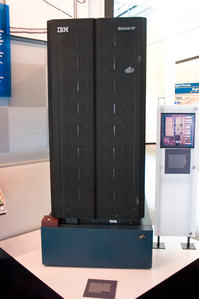
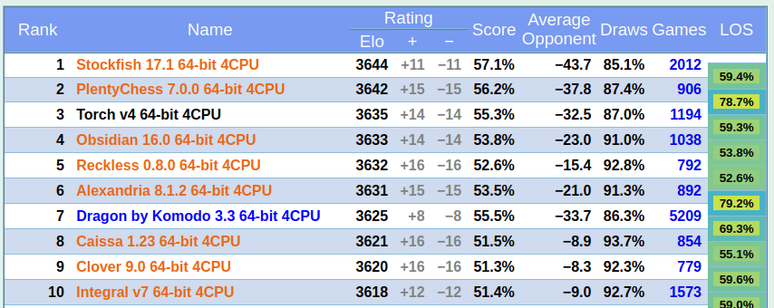
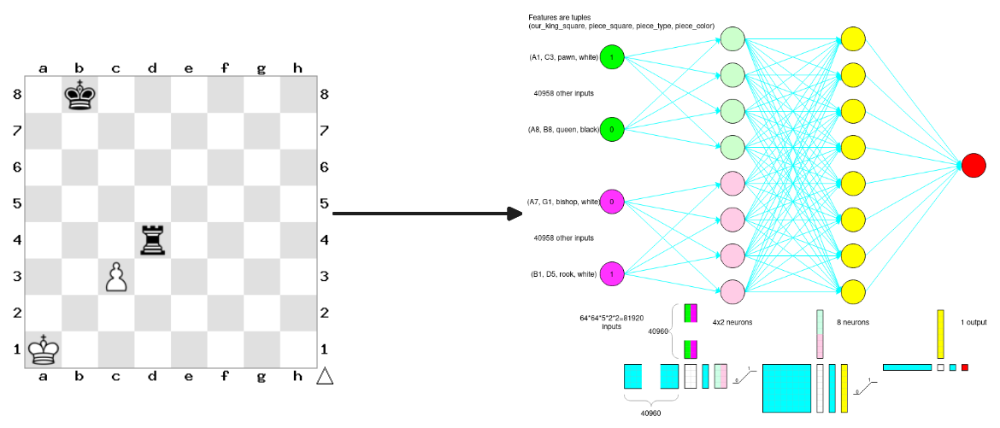
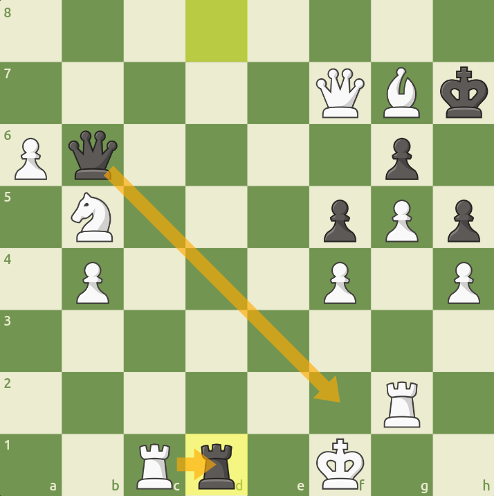

## 1 A Walk Through History

Chess is an old game. It can be traced back to chaturanga, a 7th century game from India [@murray1913history]. Apparently, there even used to be an elephant piece. Regardless, the ancient origins of chess contrast the relatively recent supremacy of computers over humans at the game. The canonical moment where machines overtook humans occurred in 1997, where *DeepBlue* defeated world champion Garry Kasporov. For the first time, the best human at chess lost a match to a computer—or should I say "clanker". At the time, DeepBlue was an impressive engineering feat. By today's standards, however, DeepBlue is an objectively bad chess engine.  

At its core, DeepBlue used a min-max tree search to find good chess moves, exploring a large amount of possible game states. It made use of a hand-crafted evaluation function that heuristically scored board positions. This approach carried on to DeepBlue's successors. We didn't see something too different until 2017, when *AlphaZero* made waves by defeating Stockfish 8 in a series of matches (though it is possible Stockfish was given suboptimal resources/compute/settings, as Tord Romstad points out [@Doggers2018AlphaZero]). See, AlphaZero was fundamentally different from the tree-search-and-handcrafted-evaluation-function paradigm that DeepBlue and its successors used. Instead, AlphaZero played with itself—dubbed self-play—until it got good [@silver2018general]. 

Technically, AlphaZero learned a neural network that, given a board state, would output a probability distribution over possible moves along with a win/loss/tie estimate. When AlphaZero plays a game, it samples a number of potential continuations of the game state in a tree-like fashion from its model's distribution over moves. Then, it finds the one that results in the best outcome and makes the first move. While this bears resemblance to the tree-search strategy of DeepBlue and Stockfish, it differs significantly in philosophy and implementation. For example, the AlphaZero paper reports that AlphaZero visits only 60,000 positions in a second, whereas Stockfish visits the mind-boggling 60 million in the same time. AlphaZero also didn't rely on any sort of "book" of predefined known board states, which Stockfish and DeepBlue both used. That's pretty incredible, but even that version of AlphaZero would be far inferior to today's Stockfish, or any of today's top engines. In this post, I hope to provide some understanding of what goes into modern chess engines.

## 2 Computers These Days

AlphaZero beat Stockfish 8 (again likely with suboptimal settings). In 2025, we are on Stockfish 17. But before I give you the details of Stockfish specifically, I think it is worth exploring how one actually evaluates two chess engines against each other. You might think you can simply sit them both down from a clean game and let them loose. This is a pretty natural idea. It also doesn't work. The problem is that at the level of modern chess engines, they would draw too many games to get accurate comparisons (probably by playing things like the Ruy Lopez, Berlin Defense over and over). Even like 5 years ago, someone pitted Lc0 and Stockfish against each other from the starting position, and it resulted in 100 straight draws [@Smit2021OpeningSelectionTCEC20]. In order to mitigate this catastrophic amount of ties, modern chess engines are made to play games from predefined openings (often drawn from real-world GM games). Here is an example opening:

These openings typically give enough of an edge for the possibility of a victory, and performance is determined over many, many games and openings. [The CCRL rankings](https://computerchess.org.uk/ccrl/4040/index.html) are perhaps the most popular rankings of current chess engines. In the particular linked rankings, there are a variety of rules and standards to make the comparison fair. For example, everyone uses the same restricted "book", there are time limits, and all algorithms are run on an Intel i7. The top 10 looks something like this:

Stockfish is sitting pretty at the top, even though over 80% of its games result in a draw. You'll notice there is an ELO column; if you have heard of chess, you have probably heard of the ELO system. An ELO rating is a way to rate players of a game, in order to determine who is better at the game, and thus more likely to win in a head-to-head match. In CCRL's case, they use [Bayeselo](https://www.remi-coulom.fr/Bayesian-Elo/)—a tool that uses a Bayesian MLE under the hood—to calculate ratings. If you are curious about their underlying likelihood model, these are equations they use:
$$ f(\Delta) = \frac{1}{1 + 10^{\Delta / 400}} $$
$$ P(\text{WhiteWins}) = f(\text{elo}_{\text{Black}} - \text{elo}_{\text{White}} - \text{elo}_{\text{Advantage}} + \text{elo}_{\text{Draw}}) $$
$$ P(\text{BlackWins}) = f(\text{elo}_{\text{White}} - \text{elo}_{\text{Black}} + \text{elo}_{\text{Advantage}} + \text{elo}_{\text{Draw}}) $$
$$ P(\text{Draw}) = 1 - P(\text{WhiteWins}) - P(\text{BlackWins}) $$

Anyways, If you start looking into these engines, you will find that they seem to all do a similar thing; an alpha-beta tree search with a NNUE (or Efficiently Updatable Neural Network). That's what Stockfish does, and in the next section, I talk a bit more about it.

## 3 How Stockfish Works

*The Stockfish team has [a blog](https://stockfishchess.org/blog/) with a lot of cool information. *

The engine Stockfish has a lot of optimizations that make it run fast on a CPU. I'm not going to talk about all of them here, mostly because I'm not familiar with them. I am, however, going to detail some of the main core components that make the current Stockfish so good.

### 3.1 Alpha-Beta Tree Search

An oldie, but goodie. The [alpha-beta tree search](https://en.wikipedia.org/wiki/Alpha%E2%80%93beta_pruning) is a min-max technique commonly used when computers need to play deterministic games. The *tree search* part comes from the fact that the computer basically starts enumerating every possible move, then every possible next move, etc. in a tree structure. The *alpha-beta* part is a technique for pruning the tree. See, it wouldn't make much sense efficiency-wise for Stockfish to consider clearly horrible moves for long—especially since the size of the tree blows up combinatorially. To combat this, Stockfish skips over and doesn't expand branches that seem clearly worse than already explored alternates. How does Stockfish decide when a branch is clearly worse, or evaluate how good a final position is? Great question, lets move onto the next section.

### 3.2 NNUE

The **E**fficiently **U**pdatable **N**eural **N**etwork (NNUE) is what many modern chess engines (including Stockfish) use to evaluate board positions. Interestingly, NNUE's were not even first used for chess—they were developed by computer scientist Yu Nasu for [shogi](https://en.wikipedia.org/wiki/Shogi) [@nasu2018efficiently]. The core insight behind NNUE is that the neural network will need to be evaluated many times, in positions that only differ by a little bit. The structure of NNUE leverages this fact to require that small changes to the board state require minimal computation compared to fully evaluating the network. The way this is done is actually pretty simple. Consider a two layer neural network:
$$ z = \sigma(W_1 x + b_2) $$
$$ \hat y = \sigma(W_2 z + b_2) $$
$$ x \in \mathbb R^n, z \in \mathbb R^m, y \in \mathbb R^p $$
Where $\sigma$ is any old activation function. If we define our network such that $n>>m$ and $x$ is a sparse binary vector, we can write:
$$ \tilde z = W_1 x + b_1 = b_1 + \sum_{i \in A[x]} w_i$$
Now if we imagine "flipping" the $j$th bit in x, all of a sudden the difference is simply the weight vector corresponding to the flipped bit. We can simply compute $\tilde z_\text{new}$ very efficiently:
$$ \tilde z_\text{new} = \tilde z \pm w_j $$
where $\pm$ depends on how the bit was flipped. This makes evaluating $\hat y_\text{new}$ incredibly efficient in our setting where $n>>m$ and $p$ is also small. In practice, during the tree search, Stockfish stores an accumulator of the first layer's preactivations $\tilde z$. In order to avoid floating point errors accumulating, intermediary nodes in the tree are also stored and used instead of backtracking from the current preactivations.

In order to do this trick, though, you need a sparse representation of a board state. One example of a very sparse representation is *HalfKP*. In HalfKP, a board state can be represented as a 40,960-dimensional binary vector. You might think that that big of a dimension is overkill, but it's actually a good thing—remember we only flip a few bits at a time, meaning we can scale the actual dimension far without sacrificing much performance. Each position in the vector corresponds to a `(king_pos, piece_pos, piece_type, color)` tuple. A 1 is stored if the tuple happens to be true, i.e. if a piece of `piece_type`  type with color `color` happens to be on square `piece_pos` and the king of color `color` happens to be on `king_pos`. A 0 is stored otherwise. It should be noted that having the `king_pos` be included for all of the color means that *a king move is the most expensive one to evaluate*, as it corresponds to the most bit flips. Here is an image from the explainer in the Stockfish docs:

I'm not going to get into it, but they also separate white and black in the first layer and keep separate accumulators. Because of how big the first weight matrix is compared to the rest of the network, one can think of the first layer as containing most of the information.

The whole thing is hyper-optimized. Things like using a clipped ReLU instead of a true ReLU to increase performance under heavy quantization are done. There is documentation on some of the stuff you do that most of this subsection is derived from [here](https://official-stockfish.github.io/docs/nnue-pytorch-wiki/docs/nnue.html). Very cool stuff!

## 4 Some Other Engines

### 4.1 PlentyChess

[PlentyChess](https://github.com/Yoshie2000/PlentyChess), which was second in the pictured CCRL rankings above, is another open source chess engine. I could not find much documentation on PlentyChess, but similar to Stockfish, it uses an NNUE to evaluate positions. The innovation of PlentyChess seems to be its "threat-input network" or the fact that they keep track of what is attacking what and use this as input to the network (at least that's what I got out of [this C++ file](https://github.com/Yoshie2000/PlentyChess/blob/main/src/threat-inputs.cpp)). The point is that PlentyChess also uses an alpha-beta tree search with an NNUE to evaluate positions.

### 4.2 Leela

[Leela](https://lczero.org/) is the spiritual successor to AlphaZero. Well, you'll actually hear it called Lc0—which I even mentioned earlier in this post. Unlike Stockfish and AnyChess, but similar to AlphaZero, Leela doesn't use a NNUE and instead opts for a larger network that predicts actions instead of soley evaluations. There is a great 2024 blog post [@lczero2024transformer] by the Leela team exploring using transformers for their architecture to encode a game state as opposed to their previous convolutional architecture. I thought it was cool how they leverage chess domain knowledge to structure embeddings in an intelligent way. At the end of the day, they find their strongest transformer model outperforms their strongest convolutional model. I would also recommend taking a look at their pretty attention figures—they made a chess board in matplotlib!

On another note, there was an absolutely beautiful game of chess played between Leela and Stockfish, where Leela, down material, find a line to sacrifice all of its pieces to force a stalemate. This was the position before the second-to-last move:

### 4.3 Torch

I have less to say on this engine, but it is definitely worth a mention. It is Chess.com's closed-source chess engine that could probably considered the second best chess engine. Originally released in 2023 [@chesscom2023torch], there is not too much to go off of for unique design decisions. The introduction post for Torch did give a shoutout to pytorch-nnue (which I believe is just [nnue-pytorch](https://github.com/official-stockfish/nnue-pytorch)), so we can safely assume they are on the NNUE train.

## 5 The Bitter Lesson

There is a blog post, [@sutton2019bitter], that many AI people love to point to. It's called *The Bitter Lesson*, and was written by one of the fathers of reinforcement learning, Richard Sutton. Sutton basically argues for the supremacy of methods that can effectively leverage more-and-more computational resources. As an aside, I actually do find the blog post to be fairly insightful, but I think it is prone to getting twisted the wrong way. Anyways, one of the examples explicitly mentioned in the blog post is chess, so I thought I'd yap about it while I'm already going on about chess—and so I feel there is some semblance of relevance to my research.

In the bitter lesson, Sutton points to two techniques that seem to scale well with compute: searching and learning. Clearly, modern chess engines do both of these. The "bitter" part of the lesson is that hand-crafted solutions don't really matter in the long run compared to these approaches. I think this conclusion misses the point. If you look back through *how* the searching and learning are implemented in modern chess engines, you see an incredible amount of *hand-crafted* and *engineered* solutions—specifically things like the way one encodes a board state and how one decides when to abandon or keep searching a branch. These engineered bits genuinely matter and make a difference. It relates back to my previous blog posts on [robustness](../robustness_and_robotics/) and [inductive biases](../free_lunch_in_robotics/); hand-crafting and engineering are not necessarily adversarial to scaling and learning, and usually the best solutions to hard problems in ML-touched areas have a bit of both—chess engines being case and point.

The end. ♟️

## References