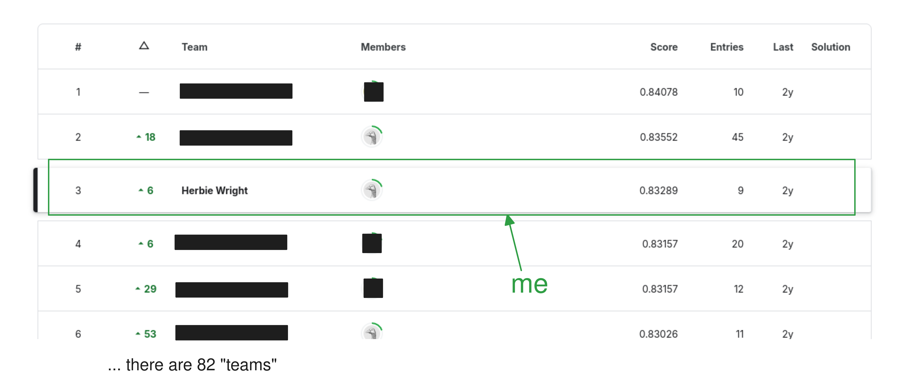
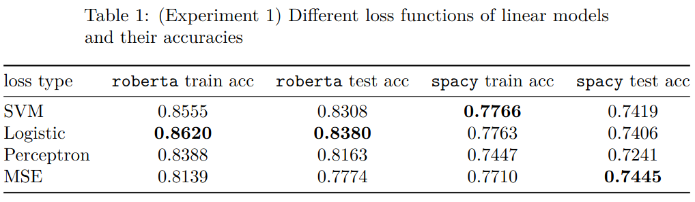
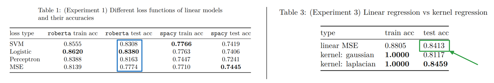

## 1 Intro: The Competition

Picture this: it's the spring semester of 2023. I'm fidgeting with a pen in a packed basement classroom as my professor introduces the final project—a [Kaggle](https://www.kaggle.com/) competition. Nothing gets me going like a competition where doing well doesn't actually earn you any extra points towards a grade and is solely for bragging rights! What I didn't know at the time, was that when the dust was settled, I would end up getting 3rd on the private leaderboard (and be the highest placing undergraduate): 

I achieved this great feat in perhaps the dumbest—or laziest—way possible, and in this post, I want to reveal my secret one-two punch that did it.

Before I reveal any secrets, I should give a brief overview of the competition. At its core, the competition was *sentiment analysis* on movie reviews (from [@pang2005seeing]). We weren't actually given the text for any movie review, but instead 3 different vector embeddings of the review. Of these different embeddings, I mainly used the RoBERTa [@liu2019roberta] ones, because they seemed to be the best empirically. The labels were binary: either 1 or 0 for good or bad review. We were given a training set with about 7,000 examples and a test set with about 1,500. Then, we were evaluated on the leaderboard with a hidden 'eval' set.

**Side Note:** *Me being me, I got 3rd on the private leaderboard and still turned in the final writeup* late *because I both wanted it to look good and constantly struggled (and kind of still struggle) with procrastination.*

## 2 The Secret Sauce

### 2.1 Kernel Regression for Classification

My first spectacular insight was to use straight-up kernel regression, a technique for *regression* problems, on a binary *classification* problem. Kernel regression is actually a very simple (and quite beautiful) method that basically brings the kernel trick to linear regression. Like with most kernel methods, it makes use of the gram matrix, $K(X, X)$, a positive-definite matrix made up of the pairwise kernel products of the $X$ data. Then, for labels $\mathbf y$, we solve for a set of parameters, $\mathbf w^*$ like so:
$$ K \mathbf w^* = \mathbf y. $$
Which can be solved fairly easily for a manageable amount of training data. A prediction is then made on new data $X'$ by matrix multiplication: $K(X, X') \mathbf w^* = \mathbf {\hat y'}$. There is more I could say about kernel regression, like how it *interpolates*, but perhaps the most relevant thing is its simplicity; you can implement it in like 3 lines of numpy code.

### 2.2 Training on the Test Set

The second insight was to simply concatenate the test and training set into a new, larger "training set" to create my model. This is one of those things that *feels* illegal, even if it isn't. I mean, in my mind, more data usually means better model, and the easiest way to get more data is to steal from the test set. It's very dumb, and I'm sure some statistician or machine learning expert is rolling in their grave, but I was determined to do well on the leaderboard without spending hours of my time. While I can't be 100% sure, I do think that this is a key part of my placement on the leaderboard.

*Does this count as cheating?* I don't think so in this case—the instructions didn't disallow it, I did run kernel regression on just the original training set, and there wasn't really anything at stake. Perhaps in some situations it could be seen as a bit dubious, however.

## 3 What Can We (I) Learn?

So basically, I was able to get 3rd by implementing a very simple kernel method and committing a couple ML *faux-pas* like training on test data and using regression techniques on a classification problem. If I were to guess why I did so well, I would chalk it up to 3 main things: (1) training with a little more data than everyone else; (2) using a perfectly analytical, interpolating method with a decent-enough inductive bias; and (3) a healthy dose of luck. I want to take this section to talk a little bit more about what we can learn from all this.

**Insight 1:** *Data matters.*

I trained on the test set to get more data. One of the things that I realized that I failed to appreciate when I first started learning ML is the importance of data: both the quality and the amount. Another important part of data is how it is represented or embedded. As part of the final report I tried using another one of the embeddings and it turns out that which embedding you choose was *more important* than the loss function for linear methods:

Of course, data making a difference is not a new idea, but even recently, [giving more credit to data](https://www.youtube.com/watch?v=ZJcvgO5gkBM) is something being pushed by people like fellow University of Utah alumn Alexei "Alyosha" Efros.

**Insight 2:** *Optimization matters.*

One cool thing about kernel regression and plain linear regression, is that you can solve it analytically. This makes it easy to find the true local minimum. SGD, on the other hand, works wonders for large, over-parameterized neural networks, but can be suboptimal for optimizing medium-dimensional linear models. In fact, while training a linear model with MSE loss really underperforms other objectives meant for classification problems on the final project data, if you analytically solve a linear model with the normal equation, you *outperform* things like logistic regression with SGD (at least during the experiment that I ran):

This suggests that being able to optimize your model effectively can sometimes matter more than some other small hyperparameter decisions.

**Insight 3:** *Don't be dogmatic about theory.*

Like I mentioned previously, I broke a couple unwritten rules. Those rules have theory around them—they aren't arbitrary, and are often useful. But, if you extrapolate a strict, unbending law from theory, you are likely missing a lot of nuance and understanding. This is kind of a part of the [overfitting post](/posts/overfitting_is_fine) I wrote previously—it is a big mistake to extrapolate the bias-variance analysis to a hard rule of "no interpolation".

There are probably many other (slightly dubious) insights to draw from the experience, but I'll just leave it there. 

## References

