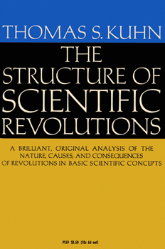

## 1 Thomas Kuhn and The Paradigm Shift

"Great books are rare. This is one. Read it and you will see." These are the words Ian Hacking uses in his introductory essay to *The Structure of Scientific Revolutions* [@kuhn2012structure]. He is right. The book, written by Thomas Kuhn in 1962, presents a radically different view of the progress of science than was commonly held at the time; a view that has undoubtedly stood the test of time—not to mention the popularization of the term "paradigm shift". My first introduction to the book came when I was assigned to read a chapter of the book during an undergraduate class. This semester, however, I decided to read the whole thing. Throughout my reading, my thoughts kept returning to how Kuhn's ideas connected to my own field, robotics. In this essay, I hope to share those thoughts and speculate a bit on the future of robotics research. Before I do that, though, I should probably give an overview of the ideas Kuhn lays out in his book. 

At its core, the book paints a picture of how science evolves via scientific revolutions, wherein pre-existing *paradigms* are challenged by new ones. This is completely different from what Kuhn calls *normal science*, which he uses to describe the majority of scientific research. Normal science is puzzle-solving *within* a paradigm, while scientific revolutions are disputes between paradigms. These disputes, Kuhn argues, are much deeper and cannot be solved by simply doing a calculation, but require converting those within the field to a new way of thinking. The book explains the structure of these revolutions, which goes something like this:

1. Normal science is being done within a paradigm
2. A *crisis* occurs, wherein *anomalies* cast doubt on the existing paradigm
3. An alternative paradigm is introduced, conflicting the existing one
4. Proponents of each paradigm try to convince each other, though the paradigms are *incommensurable*
5. One of the paradigms wins, and new textbooks are written

One of the things that Kuhn emphasizes is the *incommensurability* of paradigms. In his view, paradigms do not consist of just different equations, but completely different ways of looking at the world. Individual paradigms dictate not only what answers are acceptable, but what questions are appropriate to ask. I find this to be a fascinating claim. In a way, it reminds me of the saying, *to a man with a hammer, everything is a nail*—when you are within a certain paradigm, you confine yourself to the tools and approaches within the paradigm. The stage for a paradigm shift is set when these tools and approaches seem inadequate for some challenge or new result.

As I mentioned earlier, I want to draw a thread between Kuhn's ideas and my own field of robotics, and the related field of machine learning. I am not the first to notice a similarity between Kuhn's ideas and these academic disciplines, and in this essay I hope to briefly explore this application of his idea.

## 2 The Big Data Paradigm

### 2.1 In Machine Learning

If you take a class that covers deep learning, you have probably heard something like the following story: nobody—except perhaps a few niche researchers—believed that neural networks could do anything useful, then people started realizing the importance of data and AlexNet [@krizhevsky2012imagenet] happened, ushering in the golden age of deep learning. Ever since then, neural networks have gotten deeper, employed more and more tricks, and have been trained with more and more data. *data*. In many ways, the successes of modern machine learning, from LLMs to Vision models like SAM [@kirillov2023segment], can point to the use of vast amounts of relevant data as the key component of their success. Recognizing the importance of data, evidenced in pieces like [@halevy2009unreasonable], paved the way for neural networks and the now-ubiquotous transformer [@vaswani2017attention] we know and love today. In many ways, this mirrors the Kuhnian structure for scientific revolutions; impressive data-centric methods were seen as anomalous, setting the stage for a new data-centric deep learning paradigm in machine learning, followed by a new wave of textbooks (i.e. [@goodfellow2016deep]).

There is a 2014 piece titled *On the Current Paradigm in Artificial Intelligence* [@cristianini2014current], where Nello Cristianini uses a Kuhnian lens to explain this data-centric view as a paradigmatic change in the artificial intelligence community. In the end of the piece, he offers a sentence or two of warning: researchers should take care not fall into the trap of only asking questions that the current paradigm can answer, while ignoring important questions that elude it.

Nowadays, this data-centric paradigm reigns supreme in machine learning. People ask questions like *what data can I get easily (and how)?* and *how should I process and learn from this data?*. Various types of transformers are trained for hours upon hours on expensive GPU/TPU clusters. Most researchers are primarily focused on the questions that big data can solve. But what about the questions it can't?

### 2.2 In Robotics

There is a similar data-centric paradigm taking over robotics. At this year's ICRA (the flagship robotics research conference) there was a debate titled *Data will solve robotics and automation: True or false?*, where big names in robotics argued for and against the premise (see the picture below). A viewpoint paper recapping the debate was also released in Science [@amato2025data]. The debate even contained talk of whether some old robotics textbooks (this one [@siciliano2008springer]) were obsolete—very Kuhnian. More and more, robotics researchers seem to be acknowledging the power of data in robotics. The most successful flavor of this seems to be large-scale imitation learning, such as vision-language-action models (VLAs). Nowadays, it seems like the hottest areas in robotics are those that are on the cusp of what data can solve. Is the robotics community paying special interest to the problems big data can solve, while putting the others on the back-burner?

## 3 What is the Next Robotics Revolution?

### 3.1 The Question

Matthew Mason recently released [a blog post](https://mtmason.com/the-next-robotics-revolution/) titled *The Next Robotics Revolution*, where he expresses a bit of displeasure at current robotics trends of humanoids and generalist robots. He pitches his vision for the next robotics revolution, where robots get so general, they become specific. He draws inspiration from biology and ecosystems to define this "revolution". If one squints, one might find a Kuhnian structure to his plan. I'm not going to predict the future or set out a gameplan, but I think the question of what the next robotics revolution will be is an interesting one. Here I give my thoughts.

If big-data-centric robotics is now the prevailing paradigm, the next obvious question is what the paradigm that comes after it will look like. We can approach the question using Kuhn's proposed structure, by first asking what sort of *crisis* we might expect to see from data-centric robotics. In other words, what kind of questions and problems is data-centric robots not particularly suited to answering? For the last section of this essay, I want to briefly mention a couple potential areas that could fit this description... maybe. My high-level perspective is that the data-centric paradigm will come up short if the data needed for a problem is prohibitively difficult to get or the data doesn't tell you all you need to know.

### 3.2 Some Ideas 

**Optimality:** In today's imitation learning, demos are often collected via humans making the robot do the task. This is almost never in a truly optimal way to complete the task, and thus having policies that can achieve a task optimally requires something extra. One could imagine reinforcement learning filling this gap, but I think that, in practice, that approach relies on either having a simple task, or a pretrained policy that is already pretty close to the optimal—two things that are not necessarily true in many robotics problems.

**Safety Guarantees:** Because of the black-box nature of the models in modern data-centric approaches to robot learning, it is incredibly difficult to get useful guarantees about a learned policy. This is unfortunate, because in a lot of robotics applications, safety is very important. Yes, there are ways to make a learned policy "safer", and there are many papers published aiming to do exactly that, but to me these always feel like band-aids slapped onto a fundamental problem core to the current approach to data-centric robotics. This is also related to the reliability of a robot policy. Each "nine" you get in reliability requires more data, which makes truly reliable complex systems difficult to build (though not impossible). 

**Robotic Tasks with Little Data:** No matter how much data you have on one robot doing a specific task, if you want a kinematically different robot to do a significantly different task, in the data-centric paradigm, you will need to collect some data. However, it could be the case for many future robotics tasks that the new data is extremely difficult to get. In these cases, we need something more than a VLA. Of course, maybe there isn't that many of these tasks—you can always get at least some data, and combined with larger cross-task, cross-embodiment datasets, that is enough. Or better yet, maybe the robotics community likes to focus on the tasks where that is true. 

**Hardware Design:** Another aspect of robotics, which I am admittedly unqualified to talk about, is hardware design. This goes back to Matt Mason's blog post I mentioned above. If a robot is meant to do a specific task, it should hopefully be built to make doing the task easier. Nowadays, I can't shake the feeling that this is often not what is driving robot design today. The main draw for humanoids is how close they are to a human form. This may make getting data easier, but perhaps it also makes it harder to do some tasks compared to a better designed robot. Matt Mason's post refers to "niche robots" as robots meant to fill a specific niche by having specific algorithms and hardware. I personally think it feels a bit clumsy to try to use deep learning and big data to optimize hardware design; I feel it calls for something else.

### 3.3 Conclusion

All in all, data-centric approaches to robotics are not going away, but I think the robotics community as a whole should be cautious to, armed with the hammer of robot learning, only wear nail-colored goggles.

## References